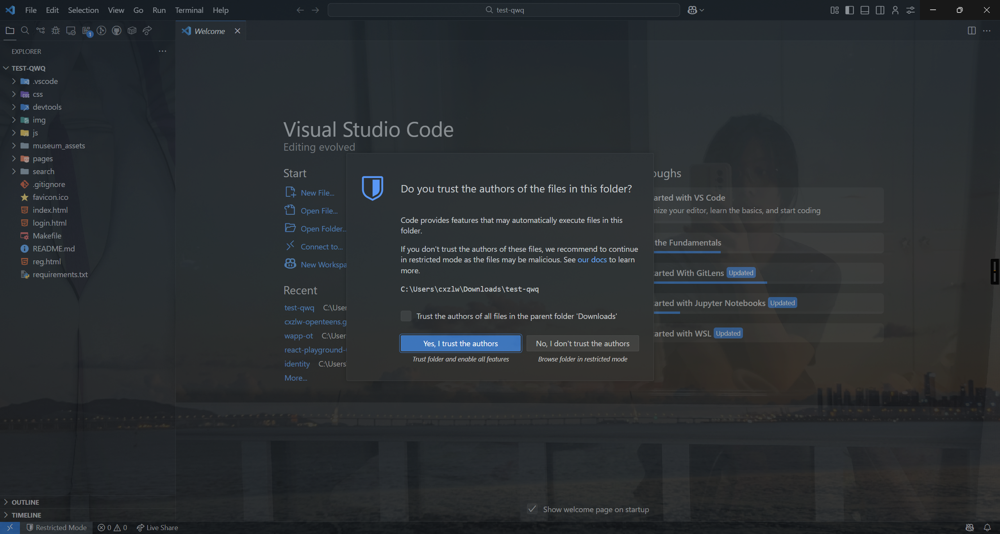
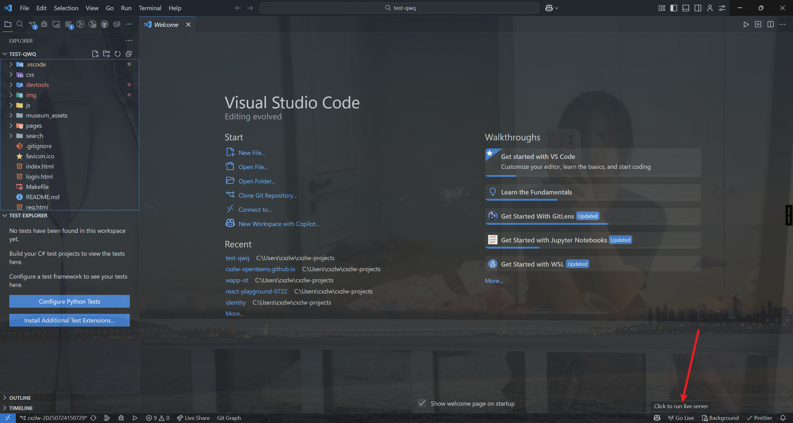

# openteens.github.io

OpenTeens Website: openteens.org

# how to build in VSCode

这个网站使用了 SPA （单页面应用）技术，因此开发流程需要配置 Live Server，这里对应的配置已经在仓库内完成。你只需要信任该存储库并安装 Live Server 插件即可进行开发。

1. Clone 这个仓库到本地并用 VSCode 打开后，你会看到图中的提示，请信任本仓库。
   

2. 下载一个插件，叫做 live server。
   

3. 你可能需要重启 VSCode，然后点击下方状态栏中的 Go Live，就可以进行开发了。
   
